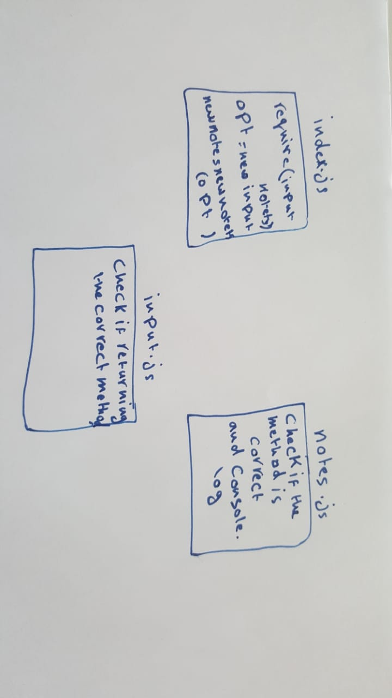

# notes
# LAB - Class 01

## Project: Notes

### Author: Anas Zain

### Links and Resources

- [submission PR](https://github.com/401-advanced-javascript-anas/notesy/pull/2)

### Modules
#### `input.js`
### `notes.js`

### Setup

#### How to initialize/run your application 

- `node index.js -a 'note1'`

#### How to use your library 
#### Tests
- Lint test: `npm run lint`

#### UML

